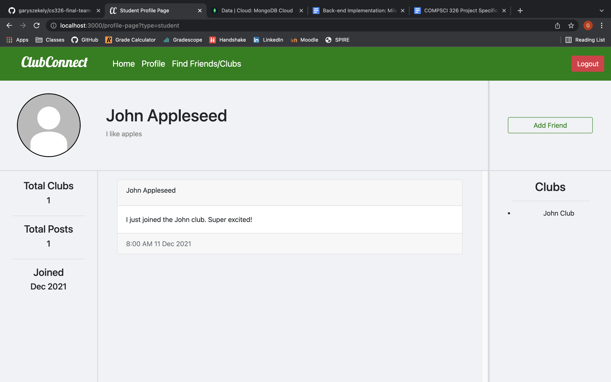

# Team Dalet
## ClubConnect - Fall 2021

### Overview

Our web application allows for students and clubs to interact with one another on a Facebook-like level. Students can befriend each other, join clubs, like clubs and post to name a few actions. Clubs can manage their members as well as post to their wall for their members to view. Our idea is innovative because there does not seem to be a streamlined way to view and join clubs at UMass and this would give students much more easier access to getting involved on campus.

### Team Members
**Name:** Gary Szekely  
**GitHub Username:** garyszekely

**Name:** Dang Le Nguyen  
**GitHub Username:** DanGithub200, Dang592

### User Interface

#### Routes

| Page Name            | Route                      | Description                                                 | Restrictions        |
|----------------------|----------------------------|-------------------------------------------------------------| --------------------|
| Landing Page         | /                          | Serves as login and signup page                             | None                |
| Home Page            | /home-page                 | Serves as entry point to the controls                       | Logged In           |
| Personal Page        | /personal-page             | Serves as page for user to edit their profile               | Logged In           |
| Find Friends/Clubs   | /find-friends-clubs        | Serves as page for students to search for friends and clubs | Logged in, Students |
| Find Members         | /find-members              | Serves as page for clubs to search for their members        | Logged in, Clubs    |
| Student Profile Page | /profile-page?type=student | Serves as page for students viewing other students profiles | Logged In, Students |
| Club Profile Page    | /profile-page?type=club    | Serves as page for students viewing clubs profiles          | Logged In, Students |
| Member Profile Page  | /profile-page?type=member  | Serves as page for clubs viewing their members profiles     | Logged In, Clubs    |

#### Preview

##### Landing Page

##### Club Home Page

##### Club Personal Page

##### Student Home Page

##### Student Personal Page

##### Find Friends/Clubs

##### Find Members

##### Student Profile Page

##### Club Profile Page

##### Member Profile Page

### API:

| API Name       | Route           | Description                                            | Parameters                                                           |
|----------------|-----------------|--------------------------------------------------------|----------------------------------------------------------------------|
| Login          | /login          | POST, Login to website                                 | BODY: { email: String, password: String, type: 'student' or 'club' } |
| Logout         | /logout         | GET, Logout of website                                 | None                                                                 |
| Create Student | /create-student | POST, Signup for students                              | BODY: { email: String, password: String, name: String }              |
| Read Student   | /read-student   | GET, Read student data                                 | QUERY: { email: String }                                             |
| Read Students  | /read-students  | GET, Read a batch of students data                     | QUERY: { searchFor: String }                                         |
| Read Members   | /read-members   | GET, Read a batch of members data                      | QUERY: { searchFor: String }                                         |
| Is Friend      | /is-friend      | GET, Check if the user and another student are friends | QUERY: { email: String }                                             |
| Add Friend     | /add-friend     | GET, Add friend for students                           | QUERY: { email: String }                                             |
| Remove Friend  | /remove-friend  | GET, Remove friend for students                        | QUERY: { email: String }                                             |
| Is Member      | /is-member      | GET, Check if user is member of club                   | QUERY: { email: String }                                             |
| Join Club      | /join-club      | GET, Join club for students                            | QUERY: { email: String }                                             |
| Leave Club     | /leave-club     | GET, Leave club for students                           | QUERY: { email: String }                                             |
| Like Club      | /like-club      | GET, Like club for students                            | QUERY: { email: String }                                             |
| Create Club    | /create-club    | POST, Signup for clubs                                 | BODY: { email: String, password: String, name: String }              |
| Read Club      | /read-club      | GET, Read club data                                    | QUERY: { searchFor: String }                                         |
| Read Clubs     | /read-clubs     | GET, Read a batch of clubs data                        | QUERY: { searchFor: String }                                         |
| Remove Member  | /remove-member  | GET, Remove member for clubs                           | QUERY: { email: String }                                             |
| Create Post    | /create-post    | POST, Create post                                      | BODY: { text: String }                                               |
| Read Posts     | /read-posts     | GET, Read posts                                        | QUERY: { email: String, type: String }                               |
| Update Post    | /update-post    | POST, Update a post                                    | BODY: { postID: String, text: String }                               |

### Database:

| Collection Name | Schema                                                                                                                                                                                            |
|-----------------|---------------------------------------------------------------------------------------------------------------------------------------------------------------------------------------------------|
| Students        | _id: ObjectId   email: String   name: String   salt: String   hash: String   bio: String   joined: String   friends: ObjectId[]   clubs: String[]   posts: ObjectId[]  |
| Clubs           | _id: ObjectId   email: String   name: String   salt: String   hash: String   bio: String   totalLikes: number   joined: String   members: String[]   posts: ObjectId[] |
| Posts           | _id: ObjectId   name: String   text: String   timestamp: String                                                                                                                          |

- Students Relationships:
    - friends: Stores the ObjectId's of the student's friends
    - clubs: Stores the names of the student's clubs
    - posts: Stores the ObjectId's of the students's posts
- Clubs Relationships:
    - members: Stores the names of the club's members
    - posts: Stores the ObjectId's of the club's posts

### Authentication

We use Passport.js to handle user authentication. Users login/signup on the landing page which uses Passport's Local Strategy to serialize and deserialize the user on login with a username and password. We also use CryptoJS to generate salt and hashes of the password for even more secure authentication. The user is only able to access the Landing Page (route: /landing-page) without logging in. If the user logs in as a student they can access every page but Find Members (route: /find-members). If the user logs in as a club they can access every page but Find Friends/Clubs (route: /find-friends-clubs).

### Deployment

https://floating-basin-00309.herokuapp.com/

### Division of Labor
- Gary Szekely
    - UI/Routing (public/index, public/styles, public/scripts, server.js):
        | Page Name            | Route                      |
        |----------------------|----------------------------|
        | Landing Page         | /                          |  
        | Find Friends/Clubs   | /find-friends-clubs        |
        | Find Members         | /find-members              |
        | Student Profile Page | /profile-page?type=student |
        | Club Profile Page    | /profile-page?type=club    |
        | Member Profile Page  | /profile-page?type=member  |

    - API (server.js):
        | API Name       | Route           |
        |----------------|-----------------|
        | Login          | /login          |
        | Logout         | /logout         |
        | Create Student | /create-student |
        | Read Student   | /read-student   |
        | Read Students  | /read-students  |
        | Read Members   | /read-members   |
        | Is Friend      | /is-friend      |
        | Add Friend     | /add-friend     |
        | Remove Friend  | /remove-friend  | 
        | Is Member      | /is-member      |
        | Join Club      | /join-club      |
        | Leave Club     | /leave-club     |
        | Like Club      | /like-club      |
        | Create Club    | /create-club    |
        | Read Club      | /read-club      |
        | Read Clubs     | /read-clubs     |
        | Remove Member  | /remove-member  |
        | Read Posts     | /read-posts     |
        | Update Post    | /update-post    |

    - Database (database.js): 
        | Function Name       |
        |---------------------|
        | authenticateStudent |
        | authenticateClub    |
        | createStudent       |
        | readStudent         |
        | readStudents        |
        | readMembers         |
        | isFriend            |
        | addFriend           |
        | removeFriend        |
        | isMember            |
        | joinClub            |
        | leaveClub           |
        | likeClub            |
        | createClub          |
        | readClub            |
        | readClubs           |
        | removeMember        |
        | readPosts           |
        | updatePost          |

- Dang Le Nguyen
    - HTML
        - Home Pages
        - Personal Pages
        - Find Club Wireframe
    - Scripts
        - parts of database.js
        - parts of server.js
    - Backend
        - Student Home Page
        - Student Personal Page
        - Club Home Page
        - Club Personal Page

### Conclusion
We felt we should have more rigorously planned out our project so that there would be less changes from our vision to the final product, which wasted our time.

### Rubric
# Final Rubric

## Frontend **___ / 50 pts**

- Landing Page **___ / 10 pts**
  - Login
    - User authentication with salt and hash
  - Signup

- Student Home Page  **___ / 1 pts**
  - logout

- Student Personal Page **___ / 1 pts**
  - logout

- Club Home Page **___ / 1 pts**
  - logout

- Club Personal Page **___ / 1 pts**
  - logut

- Find Friends/Club Page **___ / 6 pts**
  - Find students by name
  - Find clubs by name
  - Click to view profile pages

- Find Members Page **___ / 6 pts**
  - Find members by name
  - Click to view profile pages

- Student Profile Page **___ / 8 pts**
  - View student information
    - Name
    - Bio
    - Clubs
    - Posts
    - Joined
  - Add/remove friend

- Club Profile Page **___ / 8 pts**
  - View club information
    - Name
    - Bio
    - Members
    - Posts
    - Joined
  - Join/leave club

- Member Profile Page **___ / 8 pts**
  - View member information
    - Name
    - Bio
    - Members
    - Posts
    - Joined
  - Remove member

## Backend **___ / 40 pts**

- CRUD Students  **___ / 15 pts**

- CRUD Clubs **___ / 15 pts**

- CRUD Posts **___ / 10 pts**

## Misc **__ / 10 pts**

- Final Video **___ / 5 pts**

- Heroku Deployment **___ / 5 pts**

## Total **___ / 100 points**

### Video

https://www.youtube.com/watch?v=OM0axBR7OoU&list=PLbTmqqGclWPKulyyrGo2EIt9z1ZfMprdO&index=18&t=14s

