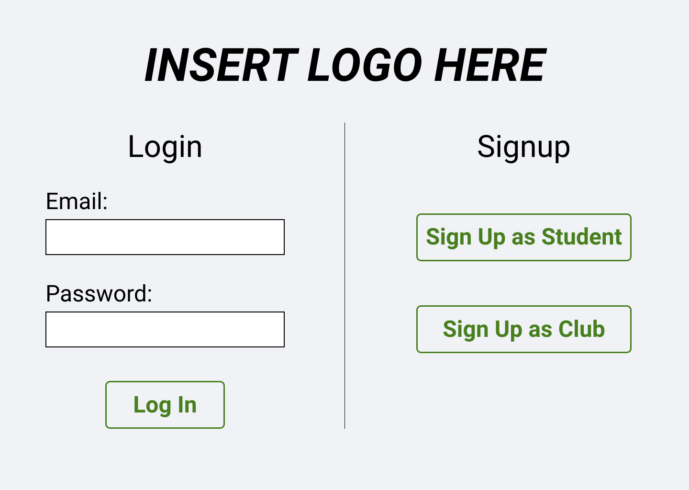
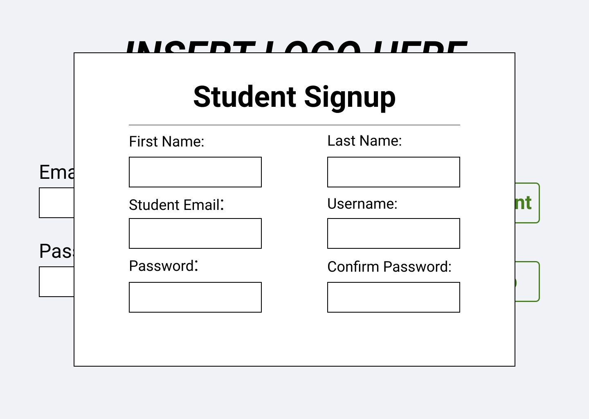
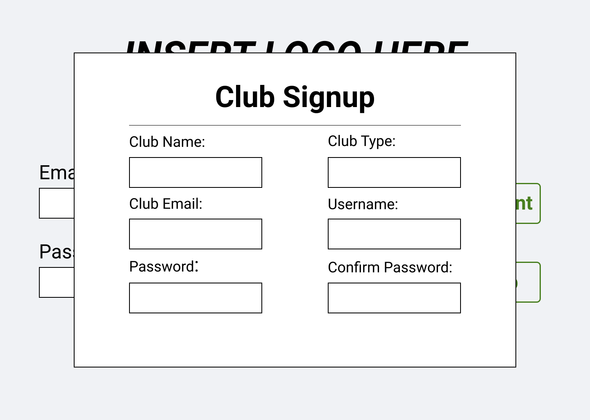
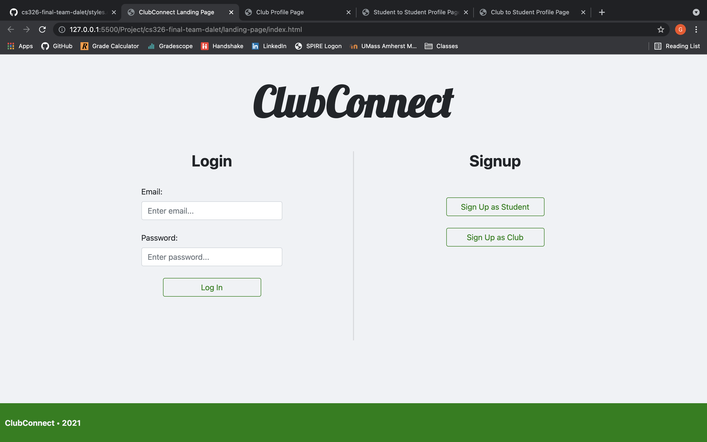
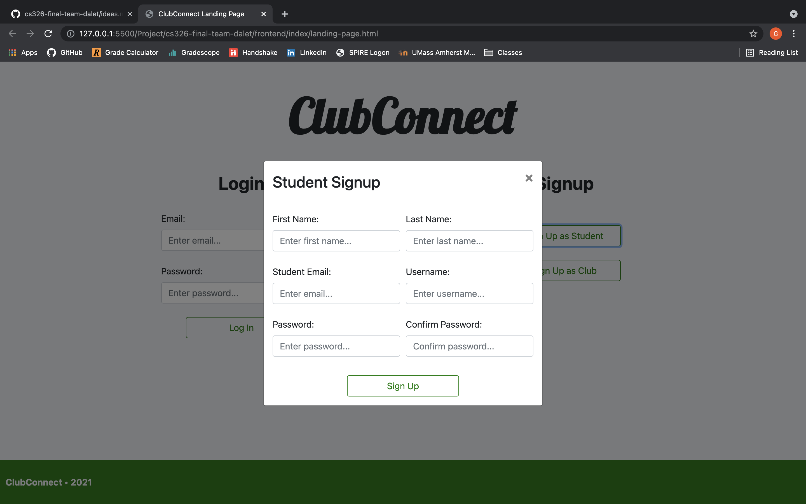
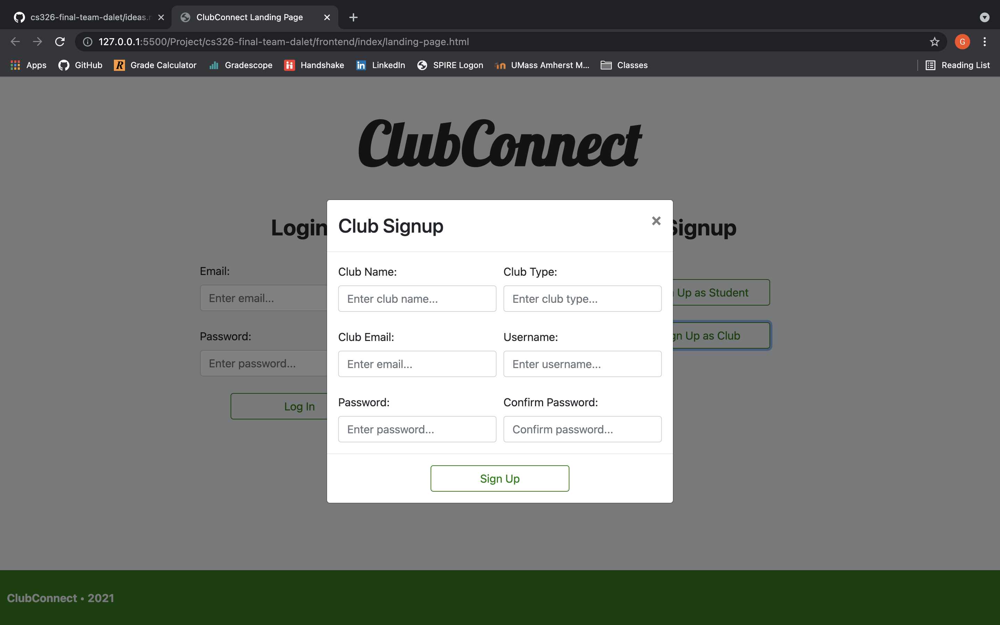
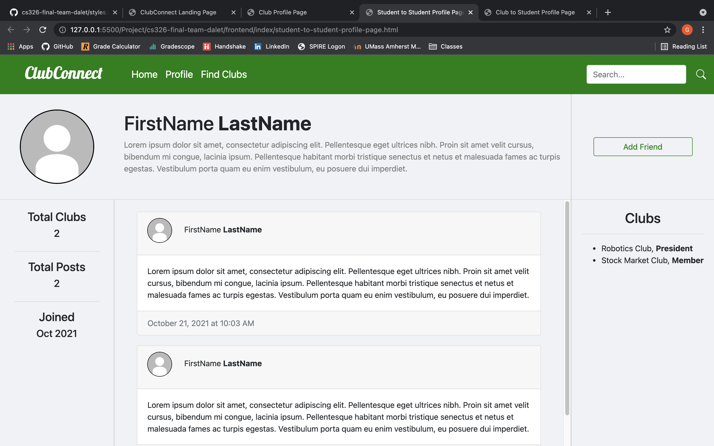
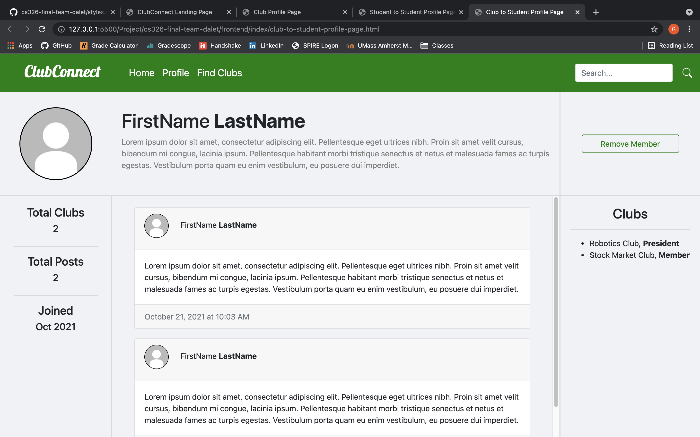

# Milestone 1

## Part 0: Data Interactions
  ### Students
  - browse list of clubs
  - filter list of clubs
  - submit join request
  - add likes to clubs
  ### Clubs
  -

## Part 1: Wireframes
  ### Landing Page
  

  The wireframe for the Landing Page. The idea was to have a minimalistic looking view on startup, such as Facebook, so the user does not get distracted by too many animations, carousels, and dropdowns. Just a simple login and signup.

  #### Student Signup
  

  The wireframe for the Student Signup modal on the Landing Page. The idea was to have a modal slide down when the student's click the "Sign Up as Student" button.

  #### Club Signup
  

  The wireframe for the Club Signup modal on the Landing Page. The idea was to have a modal slide down when club's click the "Sign Up as Club" button.

  ### Student Homepage

  ### Club Homepage

  ### Student Personal Profile Page

  ### Club Personal Profile Page

  ### Student Viewing Another Student's Profile Page

  ### Club Viewing Member's Profile Page

  ### Club Profile Page

## Part 2: HTML and CSS
  ### Landing Page
  

  The Landing Page with a login form and signup buttons for the user. We added a logo for ClubConnect and added a footer for some color.

  #### Student Signup
  
  The Student Signup modal with a signup form. We added a "X" and a "Sign Up" button for the user's navigation.

  #### Club Signup
  
  The Club Signup modal with a signup form. We added a "X" and a "Sign Up" button for the user's navigation.

  ### Student Homepage

  ### Club Homepage

  ### Student Personal Profile Page

  ### Club Personal Profile Page

  ### Student Viewing Another Student's Profile Page
  
  The Student's Profile Page from the view of another student. This is how student's can interact with another by adding them as a friend, seeing their posts, as well as other general information.

  ### Club Viewing Member's Profile Page
  
  The Student's Profile Page from the view of a club. This is how club's can interact with their members, such as removing them, seeing their posts, as well as other general information.

  ### Club Profile Page
  
  The Club's Profile Page from the view of students. This is where students will interact with clubs by joining their club, seeing their posts, as well as other general informaation. 

## Labor Division
  ### Gary Szekely
  - Landing Page
  - Landing Page Signup Modals
  - Profile Pages
  ### Dang Le Nguyen
  - Homepages
  - Personal Profile Pages
