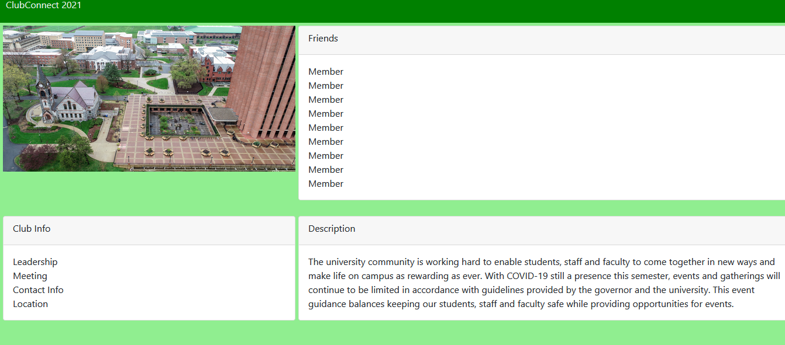
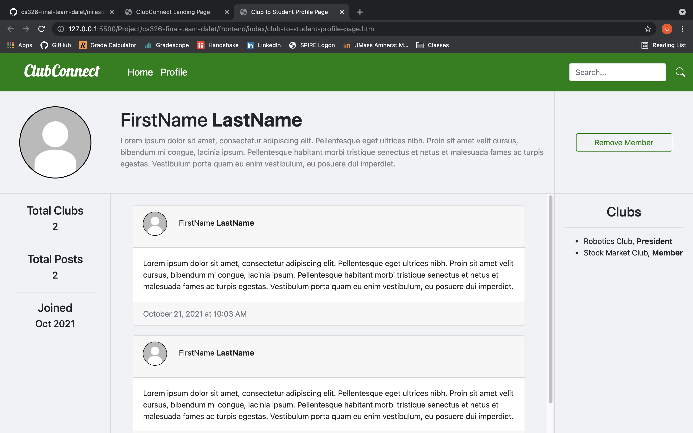
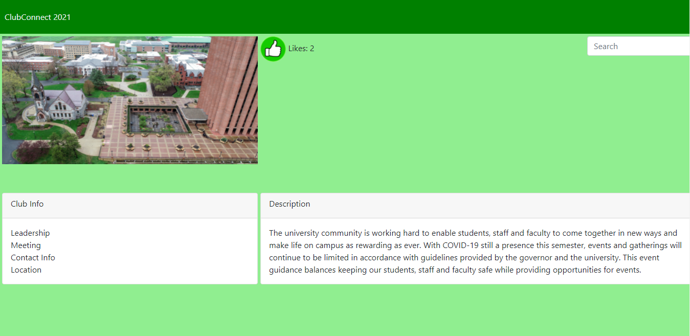

# Milestone 2

## Part 0: Project API Planning

- /login  
POST
Body: email, password  
"Login" the user by verifying that the email is associated with a user and checks if the password is correct.

- /page  
POST
Body: String of html file  
Redirects to the page indicated.

- /student/new  
POST
Body: firstName, lastName, email, username, password  
Creates a new student user from the passed in information

- /student/friend/add  
POST
Body: currUserid, otherUserid  
Adds each other to the other's friend list given the ids of the two users.

- /club/new  
POST
Body: clubName, clubType, email, username, password  
Creates a new club user from the passed in information

- /club/types  
GET  
Returns an array of the types of clubs

- /clubs  
GET  
Returns an array of club objects with fields clubName and clubDescription

- /club/member/add  
POST
Body: memberName  
Adds the specified member to the specified club

- /club/member/delete  
POST
Body: memberName  
Removes the specified member to the specified club

- /club/like/update  
POST
Body: N/A  
Adds a like to the club

- /club/like/get  
GET  
retrieve the number of likes

- /club/info/update  
POST
Body: email, contact, leaders  
Updates club info

- /club/description/update  
POST
Body: description  
Updates club description

- /student/info  
GET  
Retrieves the students information which contains name, bio, totalPosts, totalClubs, posts,friends, joined, and clubs

- /club/info  
GET  
Retrieves the clubs information which contains clubName, clubBio, totalPosts, totalMembers, totalLikes, joined, created, posts, and members

## Part 1: Backend Skeleton Code

No Input

## Part 2: Frontend Implementation

### Landing Page

The above landing page utilizes 3 APIS to function properly. The first is /login which is a READ operation since we are reading the passed in information to verify the user. The other 2 are /student/new and /club/new (depending on what the user chooses) are CREATE operations since they are creating new users with the passed in information.

### Club Personal Page  
  
The READ operation /club/info can retrieves some information to be shown to the club account.

### Club Viewing Member's Profile Page

The above club view of their member's profile pages utilizes an example of a DELETE operation when the user clicks "Remove Member" which updates the clubs members to remove that specified member. The interface also utilizes READ operations by reading all the information from /student/info to display on the page.

### Club Home Page

/club/like/update is an UPDATE operation that increase the like count. /club/info/update and /club/description/update are UPDATE operations that changes club info and club descriptions respectively.

## Part 3: Deployment

URL: https://clubconnect2021.herokuapp.com/

## Labor Division
  ### Gary Szekely
  - Landing Page Script
  - Profile Interaction Pages Scripts (Club, Club to Member, and Student to Student)
  - Find Clubs Scripts
  - APIs associated with above scripts
  ### Dang Le Nguyen
  - database.js
  - parts of server.js
  - parts of routing
